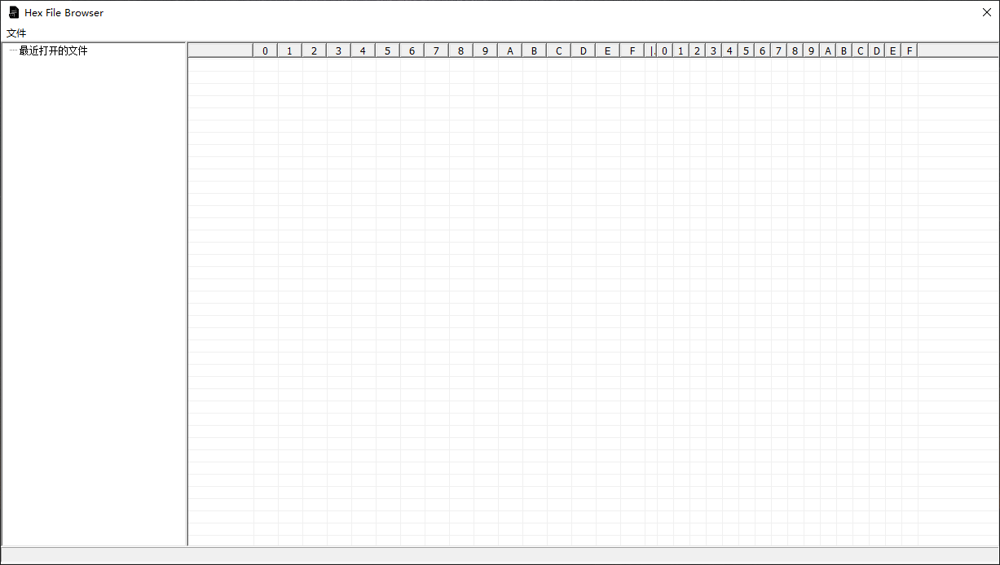
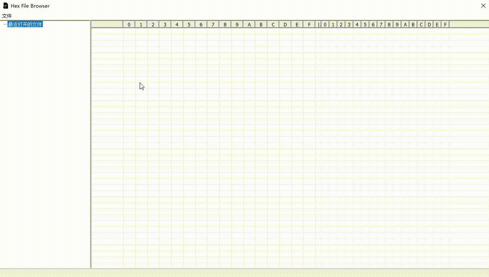

# HexFileBrowser
  使用MFC实现的16进制文件浏览器 Hexadecimal file browser implemented using MFC framework
## 技术栈 Tech stack
  c/c++/MFC
## 实现功能 Currently implemented functionality
  加载文件数据,并将其内容以16进制形式展示
  Load the file data and display its contents in hexadecimal form

  支持重新展示已加载过的数据
  Support for re-displaying loaded data

  已读取过的文件保存在历史记录中
  Files that have been read are saved in the history

  删除历史记录
  Delete history
## 界面 Interface
  主界面 main interface:
  

  Demo:

  